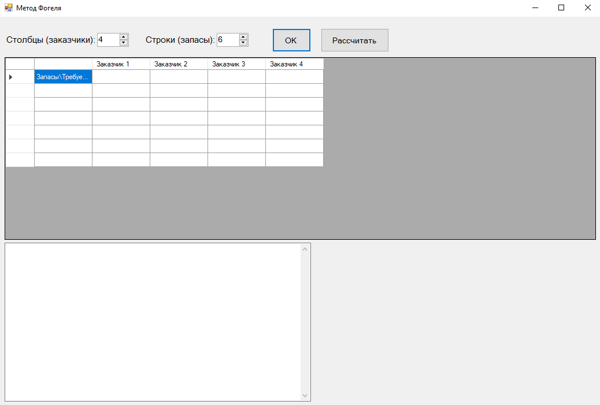

# Метод аппроксимации Фогеля

Аппроксимация Фогеля позволяет получить опорный план более приближенный к оптимальному решению, чем в случае применения других методов (за исключением разве что метода «Двойного предпочтения»). 
Сущность аппроксимации Фогеля в нахождении разности (по модулю) между парой минимальных тарифов в каждой строке и столбце. 
Затем строка или столбец с наибольшей разностью заполняются в направлении от клетки с минимальным тарифом к клетке с максимальным.

